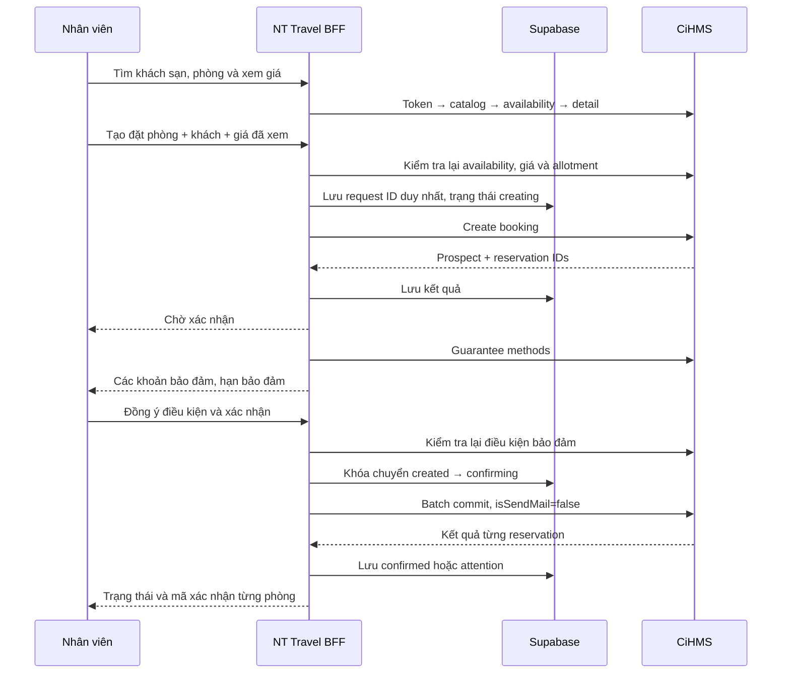

# CiHMS integration — NT Travel

## Overview & Conventions

Nguồn: request/response trong `CiHMS Booking Engine.postman_collection.json` của dự án.
Đây là mô tả implementation hiện tại dựa trên collection, chưa phải bằng chứng đã kiểm thử ghi trên tenant live.
Ngày lưu trú dùng `YYYY-MM-DD`, tiền giữ nguyên currency từ CiHMS. Một reservation ứng với một phòng.
Trình duyệt gọi BFF `/api`; token CiHMS và service key Supabase chỉ có ở server.

## Parameters CiHMS Provides to You

| Cấu hình | Ý nghĩa |
| --- | --- |
| `CLOUDHMS_API_URL` | API base URL của tenant |
| `CLOUDHMS_IDENTITY_URL` | Identity base URL |
| `CLOUDHMS_CLIENT_ID`, `CLOUDHMS_CLIENT_SECRET` | Client credentials |
| `CLOUDHMS_ORGANIZATION_ID` | Organization ID dùng lấy token |
| `CLOUDHMS_ORGANIZATION_CODE` | Organization code trong body API |
| `CLOUDHMS_DISTRIBUTION_CHANNEL_ID` | Channel được phép bán phòng |
| `CLOUDHMS_REQUESTOR_ID` | Requestor ID dùng khi tạo reservation |
| `CLOUDHMS_BOOKING_SOURCE_CODE` | Mã nguồn booking; mặc định `CRO` theo bảng mô tả collection. Xác nhận giá trị tenant; body mẫu dùng `WBS`. |
| `CLOUDHMS_TRAVEL_AGENT_NAME` | Tên profile TravelAgent gắn vào reservation; mặc định `NT_Travel` |
| `CLOUDHMS_TRAVEL_AGENT_PROFILE_ID` | profileRefID của NT_Travel do CiHMS cấp. Để trống thì CiHMS chỉ lưu tên, không liên kết profile |

Không dùng identifier mẫu trong collection làm cấu hình live. Allotment, room type và rate plan
được lấy từ availability đúng property/channel; không hardcode hoặc nhận allotment từ trình duyệt.

## Integration Flow & API Call Order

## Step 1 — Obtain an Access Token

`POST {identityUrl}/connect/token`, form URL encoded: `grant_type=client_credentials`,
`client_id`, `client_secret`, `organization_id`. Cache token đến trước khi hết hạn 60 giây.
Các request đọc được refresh token một lần khi gặp 401. Request ghi không tự gửi lại.

## Step 2 — Hotel & Room Type Catalog

- `GET /common-trd/v1/pms-property/hotels/info?page=…&limit=…`: đọc đủ trang theo page size thực tế, lọc property active.
- `GET /common-trd/v1/pms-property/room-type?hotelId=…&isPseudo=false`: tên và thông tin hạng phòng.

## Step 3 — Check Availability

- `POST /common-trd/v1/crs/booking/get-hotel-availability`
- `POST /common-trd/v1/crs/booking/get-room-availability`
- `POST /common-trd/v1/crs/booking/get-room-detail-availability`

Occupancy là số khách **mỗi phòng**, không cộng dồn. Không dùng GUID toàn số 0 làm ID.
Backend kiểm tra lại rate đúng cặp room/rate, đủ allotment cho số phòng, đủ ngày và giá trước khi tạo.
Detail được lấy cho một phòng, tổng booking là giá một phòng × số phòng. Thiếu thuế được hiển thị là chưa có dữ liệu.

## Step 4 — Create & Confirm a Booking

1. `POST /api/bookings`: kiểm tra ngày, 1–8 phòng, tối đa 30 đêm, khách đại diện, đồng ý chính sách và giá dự kiến.
2. Lưu request ID và fingerprint vào `public.bookings` trước lệnh ghi. Live dùng Supabase với quyền BFF;
   cùng request ID chỉ được tạo một lần, kể cả khi các worker nhận request đồng thời.
3. `POST /common-trd/v1/crs/booking`: `distributionChannel` (khác tên trường ở availability),
   `requestorId`, `sourceCode`, `reservations[]` với Booker/TravelAgent/Guest, totalAmount, roomOccupancy,
   referenceIds và roomRates từng ngày lấy từ dữ liệu server.
4. Đọc `data.reservations[].reservationID`, `confirmationNumber`, `status`. `Prospect` là chờ xác nhận.
5. `POST /common-trd/v1/crs/booking/{id}/guarantee-methods`: hiển thị toàn bộ khoản theo ngày,
   tổng bảo đảm và hạn. Collection lặp cùng ID qua nhiều ngày; batch commit gửi các ID duy nhất.
6. `POST /api/bookings/{id}/confirm` sau khi nhân viên đồng ý. BFF tải lại điều kiện, so hash với
   phiên bản nhân viên đã đọc và khóa trạng thái trước `POST /common-trd/v1/crs/booking/batch-commit`.
   Body dùng `guaranteeInfos`: mỗi method ID duy nhất là `guaranteePolicyId`, `detail.id` là `guaranteeRefID`, không gửi
   `guaranteeValue`. CiHMS ghi `paymentStatus=No`, `settledAmount=0`. Không dùng `guaranteeMethods`: CiHMS ghi
   `Complete`/`Credit` như đã thu tiền (kiểm chứng trên tenant test 2026-09-17).
7. Chỉ báo confirmed khi tất cả `data.items[].reservation` đúng ID, không có errorMessages và đều `Reserved`.
   `isSendMail=false`; xác nhận booking không được diễn giải là đã thu tiền.

## Step 5 — Update / Cancel / Search

Đã triển khai `GET /api/bookings` và `GET /api/bookings/{id}` để xem lại trạng thái lưu tại NT Travel,
giới hạn theo nhân viên đăng nhập. Danh sách là 100 yêu cầu gần nhất; tìm mã, khách sạn và tên khách trên danh sách đó.
Đây là trạng thái lần cuối NT Travel nhận được; không tự đồng bộ thay đổi ngoài ứng dụng.

Collection có các API dưới đây, **chưa triển khai trong giao diện/backend**:

- `PUT /common-trd/v1/crs/booking/{reservationId}` — cập nhật.
- `POST /common-trd/v1/crs/booking/{reservationId}/cancel-methods` rồi `/cancel` — xem phí trước khi hủy.
- `POST /common-trd/v1/crs/reservation/search-free-text`, `/search`, `/search-reservations` — tìm reservation trên CiHMS.

Không tự hủy Prospect khi người dùng rời màn hình. Đơn `attention` hoặc kẹt `creating`/`confirming`
cần vận hành đối soát với CiHMS bằng `NT-{requestId}` và reservation IDs trước khi thao tác tiếp.

## Step 6 — Error Codes & Handling

Các mã dưới đây là hợp đồng **BFF NT Travel**, không phải bảng mã lỗi chính thức đầy đủ của CiHMS.

| Mã | Xử lý |
| --- | --- |
| `VALIDATION_ERROR` | Sửa ngày, khách hoặc dữ liệu bắt buộc; không gọi create |
| `AUTH_REQUIRED`, `FORBIDDEN`, `PASSWORD_CHANGE_REQUIRED` | Kiểm tra phiên đăng nhập/quyền/mật khẩu tạm |
| `NO_AVAILABILITY` | Tìm lại phòng; không lấy rate đầu tiên thay cho rate đã chọn |
| `PRICE_CHANGED` | Dừng tạo, xem lại giá mới |
| `GUARANTEE_CHANGED` | Tải lại điều kiện và đồng ý lại |
| `BOOKING_CONFLICT` | Mở lại đơn theo ID; không gửi lại với dữ liệu khác |
| `BOOKING_REJECTED` | CiHMS báo business failure; không diễn giải HTTP 200 là thành công |
| `UPSTREAM_RATE_LIMITED`, `UPSTREAM_UNAVAILABLE` | Đọc có thể retry giới hạn; ghi không tự retry |

Khi create/commit timeout, lỗi mạng, batch thiếu kết quả hoặc phản hồi sai hợp đồng sau lệnh ghi,
lưu `attention` thay vì tạo lại. Nếu không lưu được kết quả thì hàng `creating`/`confirming` vẫn chặn phát lại.
Trình duyệt dùng GET để kiểm tra lại trạng thái. Log không chứa khách, token, body hoặc secret.
